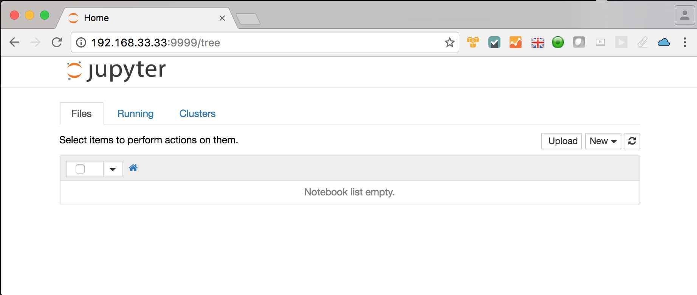
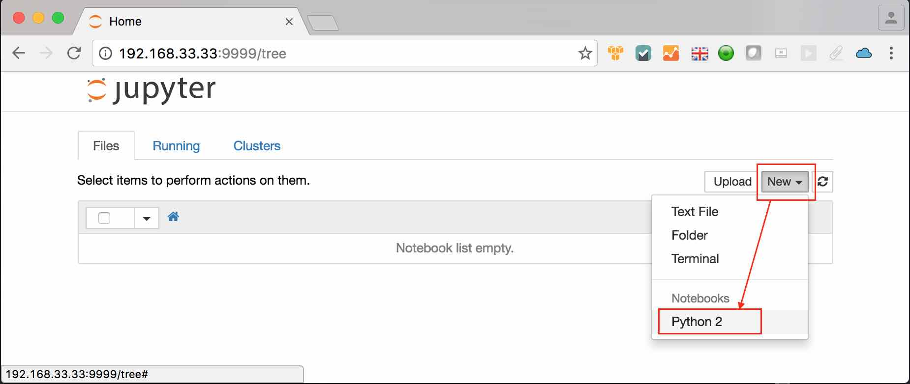
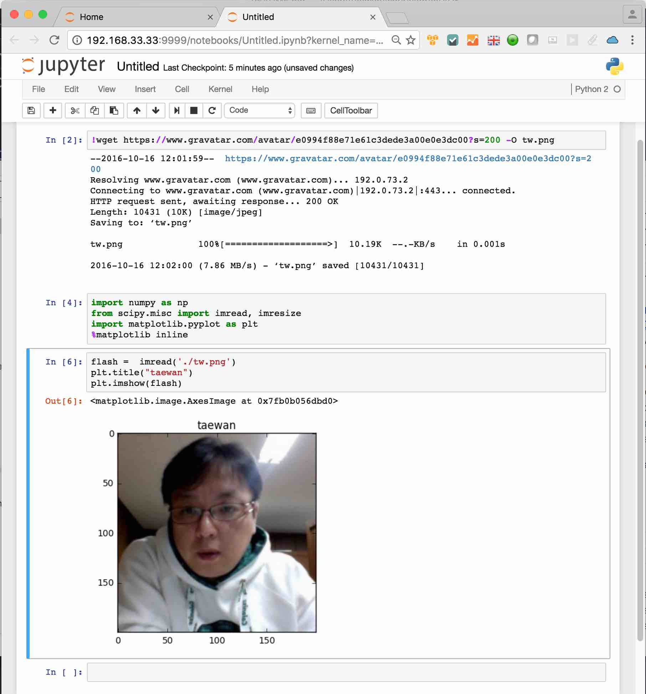

# Vagrant File for Data Science Env based on python

I create a data science environment on vagrant for study and testing with Python.
With this vagrant, we make a virtualbox vm - Ubuntu 16.04.
In the VM, Several python modules are installed that are the most popular python components.

I reference a article - [15 Python Libraries for Data Science](https://www.upwork.com/hiring/data/15-python-libraries-data-science/)


Installed softwares in the box are following

- python (2.7)
- ipython (5.1.0)
- jupyter (1.0.0)
- jupyter-client (4.4.0)
- jupyter-console (5.0.0)
- numpy (1.11.2)
- Pillow (3.4.1)
- scikit-learn (0.18)
- scipy (0.18.1)
- Scrapy (1.2.0)
- seaborn (0.7.1)
- bokeh (0.12.3)
- matplotlib (1.5.3)
- networkx (1.11)
- nltk (3.2.1)
- notebook (4.2.3)
- pandas (0.19.0)
- Pattern (2.6)
- Pillow (3.4.1)
- pip (8.1.2)
- tensorflow (0.11.0rc0)
- virtualenv (15.0.3)


## Commands for quickstart

### Precondition
- git, Vagrant and Virtualbox should be installed in target host OS.

### Building Vagrant Box
- Cloning repository from github/taewanme
- Building image of vagrant from Vagrantfile
   - build time: about 10minute

```bash
> git clone git@github.com:taewanme/vagrant4DS.git
> cd vagrant4DS
> vagrant up
```

### Login into the vagrant box

```bash
taewan@vagrant4DS $vagrant ssh
Welcome to Ubuntu 16.04.1 LTS (GNU/Linux 4.4.0-43-generic x86_64)

 * Documentation:  https://help.ubuntu.com
 * Management:     https://landscape.canonical.com
 * Support:        https://ubuntu.com/advantage

  Get cloud support with Ubuntu Advantage Cloud Guest:
    http://www.ubuntu.com/business/services/cloud

0 packages can be updated.
0 updates are security updates.


Last login: Sun Oct 16 11:49:00 2016 from 10.0.2.2
ubuntu@ubuntu-xenial:~$
```

### Startup of jupyter in the vagrant box

- Execute shell (jupyter.sh in user-home dir)


```bash
ubuntu@ubuntu-xenial:~$ ./jupyter.sh
ubuntu@ubuntu-xenial:~$ nohup: redirecting stderr to stdout

ubuntu@ubuntu-xenial:~$
```

### Access of Jupyter from Host Browser
- URL: http://192.168.33.33:9999
- location of Ipython files
   -  in the vagrant image: /vagrant/ipythons
   -  in the host os: <vagrant_box_home>/ipythons

#### Example notebook

- Step 01: Access into Jupyter Service from Host OS.


- Step 02: Creating Notebook of python2


- Step 03: Python Code with matplotlib, scipy and numpy

